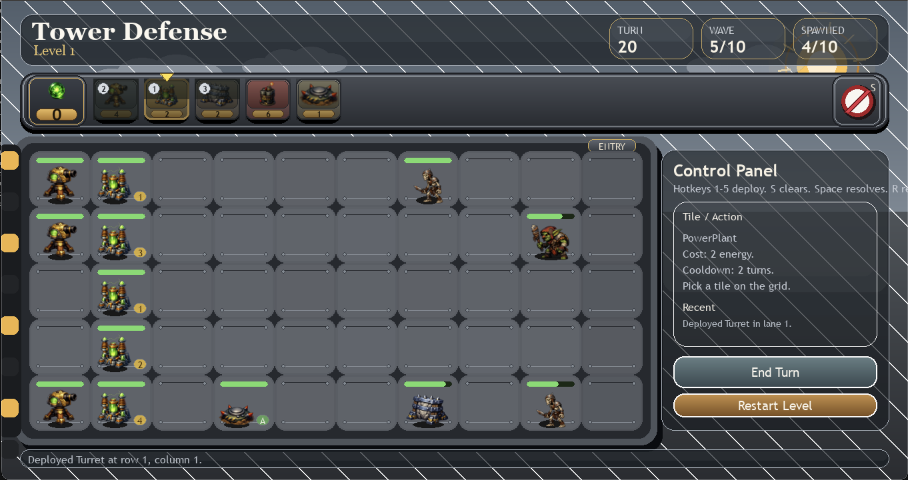
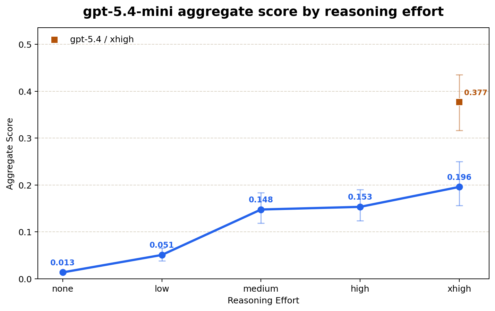

# TowDef-Bench



TowDef-Bench is a long-horizon agent benchmark designed to evaluate the ability of a large language model to manage state, coordinate dozens of tool calls, and understand multi-agent environments. It places the agent in a PVZ-like tower defense game, where the agent must use a fixed energy income to purchase turrets and fight waves of enemies. The agent must manage its energy, purchase the right turrets, and coordinate their actions to beat an individual level. The game is played through a CLI, making it entirely text-based and accessible to any language model. A companion GUI is also provided for human play and debugging.

This repository is released under `CC0-1.0`. See [`LICENSE`](LICENSE).

TowDef consists of four unique levels for the agent to play. Level 1 is a baseline environment with simple enemies and obvious towers. Level 2 extends the duration of Level 1, adds a complex enemy that requires multi-turn state tracking, and removes easy towers that clean up monsters while adding options that reward competent early play. Level 3 adds a variety of new enemies that overwhelm the player in the late game if they were shortsighted in the early game, and shifts tower selection to towers that require more strategic foresight - either by being more expensive or by having more complex interactions. Level 4 removes all straight-shooting towers and adds enemies that can push towers back and hit towers at long range, requiring complex spatial reasoning abilities and long-term planning to beat.

Level 1 is designed to be beatable by current (as of April 2026) frontier language models, Levels 2 and 3 are designed to be challenging but partially beatable by current models, and Level 4 is designed to be essentially out of reach for current models.

All levels are beatable by humans, and human-played victories can be found in the `runs/gold` directory.

Per-trial score is computed as follows. If the agent wins the level, it receives a score of `1.0`. Otherwise, let `t` be the number of waves that had spawned before the agent lost, and let `T` be the total number of waves in the level. The loss score is `0.5 * (t / T)^2`, which keeps all losses in `[0, 0.5]` while rewarding deeper runs more strongly than shallow ones. An agent's overall score for a level is the average score across `20` trials with differing random seeds.

If a trial exits without a terminal win/loss state, the full-eval runner currently treats that unresolved trial as `0.0` and records it explicitly in the report.

Final score is computed as `(s_1 + 2 * s_2 + 3 * s_3 + 4 * s_4) / 10`, where `s_i` is the average score for level `i`. This means that Level 4 is weighted more heavily than Level 1, reflecting its increased difficulty.

A table of scores for `GPT-5.4` and `GPT-5.4-mini` at `xhigh` thinking is provided below - 95% confidence intervals are computed via percentile bootstrap with 20,000 resamples.

| Model | Level 1 | Level 2 | Level 3 | Level 4 |
| --- | --- | --- | --- | --- |
| gpt-5.4 | **0.959** (0.877, 1.000) | **0.274** (0.166, 0.408) | **0.649** (0.466, 0.821) | **0.079** (0.062, 0.101) |
| gpt-5.4-mini | **0.886** (0.777, 0.975) | **0.090** (0.069, 0.112) | **0.137** (0.066, 0.247) | **0.120** (0.063, 0.220) |

And the aggregate final scores are:

| Model | Final Score |
| --- | --- |
| gpt-5.4 | **0.3768** (0.3167, 0.4362) |
| gpt-5.4-mini | **0.1958** (0.1561, 0.2476) |

A video showing a variety of GPT-5.4 xhigh rollouts on each level can be found here:

[Level 1](assets/videos/gpt-5_4-xhigh-level-1-grid.mp4) | [Level 2](assets/videos/gpt-5_4-xhigh-level-2-grid.mp4) | [Level 3](assets/videos/gpt-5_4-xhigh-level-3-grid.mp4) | [Level 4](assets/videos/gpt-5_4-xhigh-level-4-grid.mp4)

Performance on the benchmark additionally scales with reasoning effort - a plot showing the difference between `none`, `low`, `medium`, `high`, and `xhigh` reasoning effort for `gpt-5.4-mini` is shown below (with `gpt-5.4` at `xhigh` shown for reference):



# Documentation

## Repository layout

The main files are:

- `game_server.py`: game rules, entity definitions, levels, wave generation, scoring, and replay snapshots
- `cli_client.py`: human-playable CLI interface and field-guide text
- `pygame_client.py`: human-playable GUI, replay viewer, and smoke-test renderer
- `td_mcp_server.py`: MCP wrapper around the CLI game surface
- `td_codex_agent.py`: Codex-backed agent harness using the local `codex` CLI plus MCP
- `td_responses_agent.py`: Responses API-backed agent harness
- `td_benchmark.py`: single-level benchmark runner with multiple randomized trials
- `run_full_eval.py`: full 4-level evaluation runner with bootstrap confidence intervals

Generated benchmark and analysis artifacts are written under `runs/` and `output/`.

In the current layout:

- canonical benchmark/eval bundles live under `runs/full-evals-*`
- human gold traces live under `runs/gold`
- rendered comparison media and summary outputs live under `output/`
- checked-in replay-wall videos live under `assets/videos`
- runtime sprite assets live under `assets/imagegen/td-roster-v1`

## Requirements

At minimum, you need:

- Python 3
- `pygame` for the GUI client

Optional but useful dependencies:

- `ffmpeg` for benchmark replay video rendering
- the local `codex` CLI for the Codex-backed harness
- an OpenAI API key if you want to use the Responses-backed harness

## Human play

### CLI

Launch the CLI with:

```bash
python /Users/natebreslow/Documents/pvzEval/cli_client.py --level 1
```

Useful flags:

```bash
python /Users/natebreslow/Documents/pvzEval/cli_client.py --level 4 --seed 123
python /Users/natebreslow/Documents/pvzEval/cli_client.py --level 2 --no-color
python /Users/natebreslow/Documents/pvzEval/cli_client.py --level 3 --log-dir /Users/natebreslow/Documents/pvzEval/runs/gold
```

Core commands in the CLI:

- `show` or `board`: print the current board
- `deploy <name> <row> <col>`: place a defense
- `clear <row> <col>`: remove one of your defenses
- `inspect <row> <col>`: inspect a tile
- `guide <abbr>`: print the detailed guide entry for a defense or monster
- `next`: advance exactly one turn
- `status`: print loadout, cooldowns, and active entities
- `level <n>`: load a different level
- `instructions`: print the full gameplay guide

The CLI is the canonical text surface that the MCP server and the agent harnesses build on top of.

### GUI

Launch the GUI with:

```bash
python /Users/natebreslow/Documents/pvzEval/pygame_client.py --level 1
```

Useful flags:

```bash
python /Users/natebreslow/Documents/pvzEval/pygame_client.py --level 4 --seed 123
python /Users/natebreslow/Documents/pvzEval/pygame_client.py --level 4 --log-dir /Users/natebreslow/Documents/pvzEval/runs/gold
python /Users/natebreslow/Documents/pvzEval/pygame_client.py --replay-log /absolute/path/to/run.jsonl
```

The GUI supports:

- live human play
- replaying saved JSONL trajectories
- smoke-test rendering for asset/debug checks

## Logging and replay

Both the CLI and GUI can record manual trajectories with `--log-dir`. These logs are replay-compatible JSONL files and can be opened in the pygame replay viewer later.

Examples:

```bash
python /Users/natebreslow/Documents/pvzEval/cli_client.py --level 4 --seed 123 --log-dir /Users/natebreslow/Documents/pvzEval/runs/gold
python /Users/natebreslow/Documents/pvzEval/pygame_client.py --level 4 --seed 123 --log-dir /Users/natebreslow/Documents/pvzEval/runs/gold
python /Users/natebreslow/Documents/pvzEval/pygame_client.py --replay-log /Users/natebreslow/Documents/pvzEval/runs/gold/<log>.jsonl
```

Agent rollouts are also persisted as JSONL logs plus text transcripts, so human and agent runs can be inspected through the same replay path.

## Agent harnesses

### Codex-backed harness

Run a one-shot autonomous attempt through the local Codex CLI:

```bash
python /Users/natebreslow/Documents/pvzEval/td_codex_agent.py \
  --level 3 \
  --model gpt-5.4 \
  --reasoning-effort xhigh
```

This harness:

- creates an isolated `CODEX_HOME`
- registers the TowDef MCP server
- lets Codex use the game as a native MCP tool surface
- writes a JSONL run log and a text transcript

### Responses-backed harness

Run the API-backed harness with:

```bash
python /Users/natebreslow/Documents/pvzEval/td_responses_agent.py \
  --level 3 \
  --model gpt-5.4 \
  --api-key-file /absolute/path/to/openai_api_key.txt
```

Useful optional flags include `--base-url`, `--max-rounds`, and `--interactive`.

### MCP server

The MCP server is usually launched internally by the harnesses, but it can also be run directly:

```bash
python /Users/natebreslow/Documents/pvzEval/td_mcp_server.py --level 2 --agent-mode
```

If you want to watch the current board state in a separate spectator window while a client drives the MCP tools, add `--gui-mirror`:

```bash
python /Users/natebreslow/Documents/pvzEval/td_mcp_server.py \
  --level 2 \
  --agent-mode \
  --gui-mirror
```

`--gui-mirror-delay` controls how quickly the spectator window advances through mirrored board states.

## Using with local models

The standalone MCP server is designed so local tool-using models can play TowDef as a normal MCP tool surface. The most straightforward setup today is LM Studio.

Important detail: `td_mcp_server.py` is a stdio MCP server. LM Studio should spawn it from `mcp.json`; you generally should not start it manually first.

Example `mcp.json` entry for Level 4 with the one-attempt agent surface and the GUI mirror enabled:

```json
{
  "mcpServers": {
    "towdef-level4": {
      "command": "/Users/natebreslow/miniconda3/bin/python",
      "args": [
        "/Users/natebreslow/Documents/pvzEval/td_mcp_server.py",
        "--level",
        "4",
        "--seed",
        "7",
        "--agent-mode",
        "--gui-mirror",
        "--gui-mirror-delay",
        "0.4"
      ],
      "cwd": "/Users/natebreslow/Documents/pvzEval"
    }
  }
}
```

Notes:

- keep `--agent-mode` if you want the same restricted one-attempt tool surface used by the benchmark harnesses
- remove `--agent-mode` if you want raw CLI parity, including `restart` and `cli_command`
- duplicate the entry with different `--level` values if you want one server shortcut per level
- the mirror window is only a spectator; it does not affect gameplay or the MCP protocol

Example local-model videos:

- [Qwen3.5 27B in LM Studio, using MCP](assets/videos/qwenlmstudioplay.mov)
- [Footage of Qwen3.5 27B's Playthrough](assets/videos/qwenplaythrough.mov)

## Running benchmarks

### Single-level benchmark

Run a benchmark on one level with:

```bash
python /Users/natebreslow/Documents/pvzEval/td_benchmark.py \
  --backend codex \
  --level 3 \
  --model gpt-5.4 \
  --reasoning-effort xhigh \
  --trials 20 \
  --parallelism 5
```

The benchmark runner:

- randomizes the game seed per trial
- supports both `codex` and `responses` backends
- writes each trial's stdout/stderr plus rollout logs
- writes an incremental `benchmark_report.json`
- prints progress lines when new waves are reached

### Full 4-level evaluation

Run the full weighted evaluation with:

```bash
python /Users/natebreslow/Documents/pvzEval/run_full_eval.py \
  --backend codex \
  --model gpt-5.4 \
  --reasoning-effort xhigh
```

By default, this runs:

- levels `1 2 3 4`
- `20` trials per level
- `parallelism 5`
- `20,000` bootstrap resamples for confidence intervals

The full-eval runner writes a bundle under:

```text
runs/full-evals-<model>-<reasoning>/td-full-eval-<timestamp>/
```

Inside that bundle:

- `full_eval_report.json`
- `full_eval_report.md`
- `benchmarks-<model>-<reasoning>/...` with one benchmark directory per level

## Analysis utilities

The repository also includes scripts for post-processing benchmark results:

- `plot_benchmark_scores.py`: build comparison charts from benchmark reports
- `render_benchmark_grid_videos.py`: render a `5x4` replay wall for benchmark trial sets

Current checked-in outputs include:

- `assets/videos/`: rendered replay-wall MP4s
- `output/benchmark_scores_codex_lines.png`: by-level comparison chart
- `output/gpt54mini_codex_reasoning_curve.png`: `gpt-5.4-mini` aggregate score by reasoning effort

Example:

```bash
python /Users/natebreslow/Documents/pvzEval/render_benchmark_grid_videos.py \
  --model gpt-5.4 \
  --reasoning-effort xhigh \
  --levels 1 2 3 4
```

### A Quick Note

TowDef-Bench is not meant to be proof of what LLMs cannot do in general - with a specialized harness, repeated tries, and domain-specific prompt tuning, frontier LLMs could potentially achieve higher performance. The point is instead to provide a challenging single-shot environment that corresponds to a class of real-world tasks that current LLMs struggle with - long-horizon tool reasoning in complex multi-agent environments with little prior context. Thus the benchmark is primarily intended as a relative comparison between models and as a way to measure progress on this class of tasks, rather than as an absolute statement of current capabilities or limitations.

### Future Work

This benchmark has many natural extensions - the agent could be allowed multiple tries per level to measure the ability to learn from catastrophic error, or the agent could attempt all levels in sequence to measure continual learning. The main bottleneck of these extensions would be the extreme context length requirements that require agent harnesses to manage compaction. Thus these extensions may be more feasible in the future as compaction becomes more standard cross-provider, or other methods of continual learning and state management become more developed.

Additionally, evaluation of models is quite sparse right now - only GPT-5.4 and GPT-5.4 mini. This is because these models are readily available through the Codex CLI where prompt caching is enabled. OpenRouter-based runs with inconsistent prompt caching could cost upwards of hundreds of dollars for the full benchmark and thus aren't included in the current release. Anthropic has its own parralel version of the responses API that supports prompt caching, but due to a lack of funds, I haven't ran the benchmark on that API yet. Building a version of the agent harness that supports Anthropic's API should be straightforward.

#### AI Usage Disclaimer
This benchmark was developed with substantial implementation assistance from OpenAI’s GPT-5.4 (via Codex), which helped write and refine parts of the game engine, evaluation harnesses, analysis tooling, and documentation. I assume responsibility for everything here.
